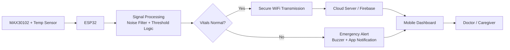
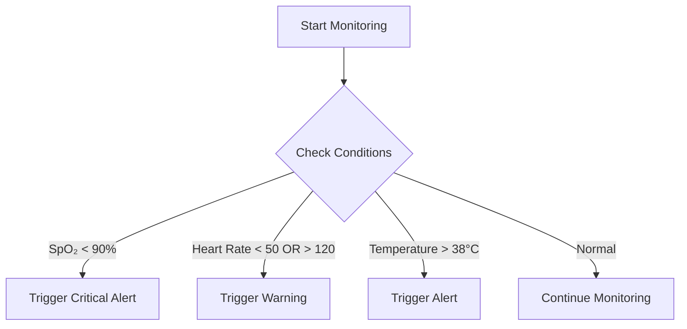
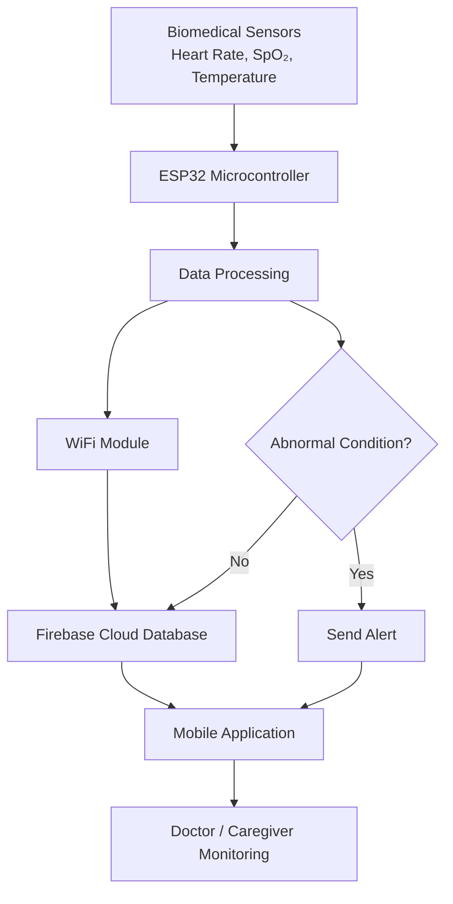

# IoT-Based Smart Healthcare Monitoring System

## Project Overview

**Project Category:** Deep-tech / IoT Based / System Based  
**Projexa Team Id:** 26E3113  

Submitted in partial fulfilment of the requirement of the degree of  
**Bachelors of Technology (CSE Core - Section D)**  
K.R Mangalam University  

### Team Members
- Nikhil Singh (2301010239)  
- Rucchika Kapoor (2301010240)  
- Yash Karmakar (2301010217)  
- Avanish Thapliyal (2301010243)  
- Kamaljeet Hooda (2301010244)  
  

---

## Abstract

The IoT-Based Smart Healthcare Monitoring System enables continuous and remote monitoring of patient health parameters such as heart rate, blood oxygen saturation (SpO₂), and body temperature.

Traditional healthcare systems rely on periodic checkups and manual supervision, which leads to delayed detection of critical conditions. This system addresses these limitations by integrating biomedical sensors with an ESP32 microcontroller to collect real-time data and transmit it to a cloud platform.

The data is processed and visualized through a mobile application, allowing doctors and caregivers to monitor patient health remotely. The system also incorporates an automated alert mechanism to notify stakeholders in case of abnormal readings.

---

## Problem Statement

Conventional healthcare monitoring systems:
- Do not provide real-time health tracking  
- Depend on frequent hospital visits  
- Delay detection of critical conditions  

There is a need for a system that enables:
- Continuous monitoring  
- Remote accessibility  
- Immediate emergency alerts  

---

## Objectives

- Develop an IoT-based healthcare monitoring system  
- Monitor vital parameters:
  - Heart rate  
  - SpO₂  
  - Body temperature  
  - Faint detection  
- Implement cloud-based data storage and visualization  
- Design an automated emergency alert system  

---

## System Architecture

The system follows a layered architecture:

1. **Sensing Layer**
   - Biomedical sensors collect physiological data

2. **Processing Layer**
   - ESP32 microcontroller processes sensor data

3. **Communication Layer**
   - Wi-Fi module transmits data to cloud

4. **Cloud Layer**
   - Firebase stores and manages real-time data

5. **Application Layer**
   - Android app displays data and alerts

---

### Architecture Diagram
## System Workflow

---

## Data Flow and Pipeline

The system follows a continuous real-time data pipeline:

## System Workflow

---

### Data Handling Process
1. Sensors capture physiological data  
2. ESP32 processes and formats data (JSON format)  
3. Data transmitted via Wi-Fi  
4. Firebase stores and updates data in real-time  
5. Mobile app fetches and displays data  
6. Alert system evaluates thresholds  

---

## Alert Mechanism (Core Logic)

The system uses threshold-based decision logic:

### Alert Delivery
- Mobile notifications  
- Caregiver alerts  
- Emergency response trigger  

---

## Tools and Technologies

### Programming Language
- Python (data processing, backend logic)

### Hardware
- ESP32 Microcontroller (Wi-Fi enabled)  
- Pulse Sensor  
- SpO₂ Sensor  
- Temperature Sensor  

### Cloud Platform
- Firebase (real-time database)

### Mobile Application
- Android App for monitoring and alerts  

---

## Methodology

### 1. Data Acquisition
Sensors continuously measure vital parameters

### 2. Data Processing
ESP32 filters and processes sensor data

### 3. Data Transmission
Processed data is sent to Firebase via Wi-Fi

### 4. Cloud Storage
Data is stored securely and updated in real-time

### 5. Visualization
Mobile app displays health data

### 6. Emergency Handling
Alerts triggered when thresholds are exceeded

---

## Performance Metrics

| Metric | Description |
|------|------------|
| Latency | Time delay from sensor to app |
| Accuracy | Reliability of sensor readings |
| Response Time | Time taken to trigger alerts |
| Reliability | System uptime and consistency |

---

## Gap Analysis (Improved Positioning)

| Limitation in Existing Systems | Proposed Solution |
|------------------------------|------------------|
| Limited parameter monitoring | Multi-parameter tracking |
| No real-time alerts | Automated alert system |
| High cost | Cost-effective implementation |
| Poor accessibility | Mobile-based monitoring |
| Weak security | Controlled access and authentication |

---

## Use Case Scenarios

### 1. Elderly Patient Monitoring
Continuous monitoring without hospital visits

### 2. Emergency Detection
Instant alerts for abnormal conditions

### 3. Rural Healthcare
Remote monitoring where hospitals are inaccessible

---

## Flow Chart / Architecture Diagram

## Future Scope

- Integration with AI for predictive healthcare  
- Wearable device miniaturization  
- Integration with hospital management systems  
- Advanced analytics and reporting  

---

## References

1. IoT Based Healthcare Monitoring System – Sensors Journal (2022)  
2. Security in Medical IoT – Security & Communication Networks (2018)  
3. Cloud-Based E-Health Systems – Symmetry (2021)  
4. ESP32-Based Healthcare Monitoring System (2020–2025)  
5. Firebase Realtime Database Documentation  
6. Smart E-Healthcare Systems (IoT + Cloud + AI)  

---

## Final Evaluation

This system provides:
- Real-time monitoring  
- Remote accessibility  
- Automated emergency response  

It improves:
- Patient safety  
- Response time  
- Healthcare efficiency  

While challenges such as sensor accuracy and data security remain, the system establishes a scalable foundation for modern digital healthcare.
